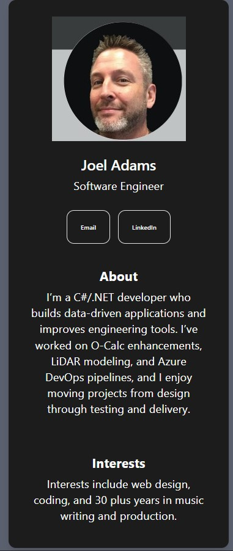

# Digital Business Card

A modern, responsive digital business card built with React, TypeScript, and Vite. Showcase your professional profile with a sleek, interactive design.



## Features

- 📱 Fully responsive design
- ⚡ Fast performance with Vite
- 🎨 Clean, professional UI
- 🔗 Social media links (Email, LinkedIn)
- 📄 About section and interests display

## Tech Stack

- **React 19** - UI framework
- **TypeScript** - Type safety
- **Vite** - Build tool with HMR
- **CSS** - Modern styling

## Getting Started

### Prerequisites
- Node.js (v16 or higher)
- npm or yarn

### Installation

```bash
npm install
```

### Development

```bash
npm run dev
```

Opens at `http://localhost:5173` (default Vite port)

### Build

```bash
npm run build
```

Generates optimized production build in the `dist/` folder.

### Preview

```bash
npm preview
```

## Project Structure

```
src/
├── App.tsx          - Main application component
├── App.css          - App styling
├── Photo.tsx        - Photo component
├── main.tsx         - Entry point
├── index.css        - Global styles
└── assets/          - Static assets
```

## Usage

Edit your profile information in the components to customize the business card with your details, photo, and social links.

## License

MIT
import reactDom from 'eslint-plugin-react-dom'

export default defineConfig([
  globalIgnores(['dist']),
  {
    files: ['**/*.{ts,tsx}'],
    extends: [
      // Other configs...
      // Enable lint rules for React
      reactX.configs['recommended-typescript'],
      // Enable lint rules for React DOM
      reactDom.configs.recommended,
    ],
    languageOptions: {
      parserOptions: {
        project: ['./tsconfig.node.json', './tsconfig.app.json'],
        tsconfigRootDir: import.meta.dirname,
      },
      // other options...
    },
  },
])
```
